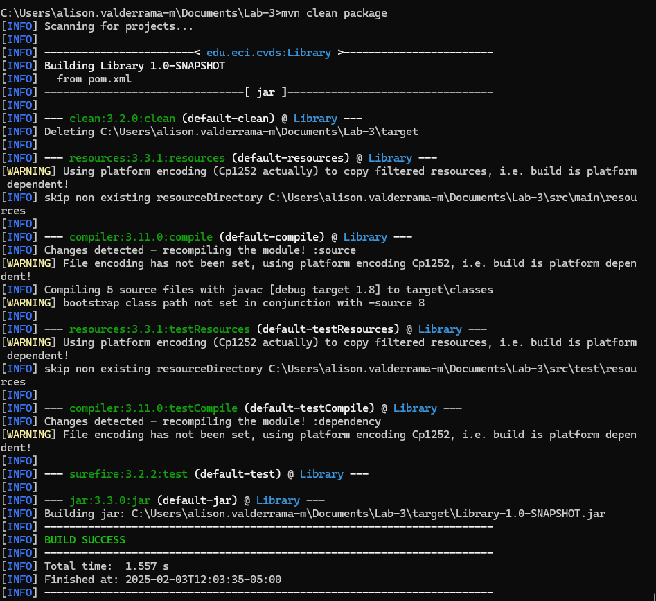
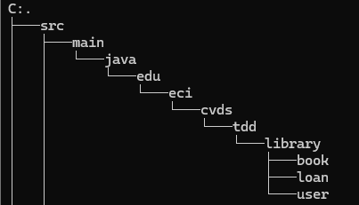

# Laboratorio 3: Testing - TDD

## Pre-requisitos
Antes de comenzar, asegúrate de tener instaladas las siguientes herramientas:

- **Java**: OpenJDK Runtime Environment 17.x.x
- **Apache Maven**: 3.9.x
- **JUnit**: 5.x.x
- **Docker**

## Objetivos
En este laboratorio aprenderemos a:

- Escribir y ejecutar **pruebas unitarias**.
- Utilizar anotaciones `@Test` del framework **JUnit**.
- Aplicar el enfoque **Test-Driven Development (TDD)**.

## Descripción del Proyecto
El proyecto consiste en un **sistema de gestión de bibliotecas**, con las siguientes clases principales:

- `Libro`: Representa un libro en la biblioteca.
- `Usuario`: Representa a un usuario que puede tomar libros prestados.
- `Prestamo`: Representa el préstamo de un libro a un usuario.
- `Biblioteca`: Gestiona los préstamos, verifica disponibilidad de libros y mantiene un registro de los préstamos realizados.

## Crear Proyecto con Maven
Deben crear un proyecto Maven con los siguientes parámetros:

```sh
mvn archetype:generate \
    -DgroupId=edu.eci.cvds \
    -DartifactId=LibraryManagement \
    -DarchetypeArtifactId=maven-archetype-quickstart \
    -DarchetypeVersion=1.0 \
    -Dpackage=edu.eci.cvds.library \
    -DinteractiveMode=false
```
Creacion del proyecto

 

 ## Configuración de JUnit en `pom.xml`
Para agregar **JUnit 5** al proyecto, editen el archivo `pom.xml` y agreguen la siguiente dependencia:

  

```xml
<dependencies>
    <dependency>
        <groupId>org.junit.jupiter</groupId>
        <artifactId>junit-jupiter-api</artifactId>
        <version>5.9.1</version>
        <scope>test</scope>
    </dependency>
    <dependency>
        <groupId>org.junit.jupiter</groupId>
        <artifactId>junit-jupiter-engine</artifactId>
        <version>5.9.1</version>
    </dependency>
</dependencies>
```

## Esqueleto del proyecto
Cree los siguientes paquetes dentro de edu.eci.cvds.tdd

 - library
   - book
   - loan
   - user

 
