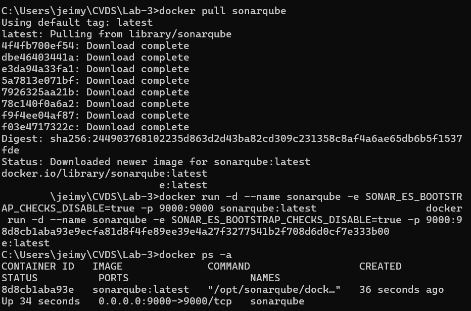

# Laboratorio 3: Testing - TDD
##
Integrantes:
- Alison Valderrama
- Jeimy Yaya

## Objetivos
En este laboratorio aprenderemos a:

- Escribir y ejecutar **pruebas unitarias**.
- Utilizar anotaciones `@Test` del framework **JUnit**.
- Aplicar el enfoque **Test-Driven Development (TDD)**.

## Descripción del Proyecto
El proyecto consiste en un **sistema de gestión de bibliotecas**, con las siguientes clases principales:

- `Libro`: Representa un libro en la biblioteca.
- `Usuario`: Representa a un usuario que puede tomar libros prestados.
- `Prestamo`: Representa el préstamo de un libro a un usuario.
- `Biblioteca`: Gestiona los préstamos, verifica disponibilidad de libros y mantiene un registro de los préstamos realizados.

## Crear Proyecto con Maven
Deben crear un proyecto Maven con los siguientes parámetros:

```sh
mvn archetype:generate \
    -DgroupId=edu.eci.cvds \
    -DartifactId=LibraryManagement \
    -DarchetypeArtifactId=maven-archetype-quickstart \
    -DarchetypeVersion=1.0 \
    -Dpackage=edu.eci.cvds.library \
    -DinteractiveMode=false
```
Creacion del proyecto

 

 ## Configuración de JUnit en `pom.xml`
Para agregar **JUnit 5** al proyecto, editen el archivo `pom.xml` y agreguen la siguiente dependencia:

  

```xml
<dependencies>
    <dependency>
        <groupId>org.junit.jupiter</groupId>
        <artifactId>junit-jupiter-api</artifactId>
        <version>5.9.1</version>
        <scope>test</scope>
    </dependency>
    <dependency>
        <groupId>org.junit.jupiter</groupId>
        <artifactId>junit-jupiter-engine</artifactId>
        <version>5.9.1</version>
    </dependency>
</dependencies>
```

## Esqueleto del proyecto
Cree los siguientes paquetes dentro de edu.eci.cvds.tdd

 - library
   - book
   - loan
   - user

 

## Pruebas UNITARIAS y TDD
Para compilar el proyecto y ejecutar las pruebas unitarias, usen los siguientes comandos:

```sh
mvn clean test
```


## Aplicación de TDD
Para implementar **TDD**, seguimos estos pasos:

1. **Escribir una prueba unitaria fallida**: Crear una prueba para una funcionalidad aún no implementada.
2. **Implementar la funcionalidad mínima**: Escribir el código necesario para que la prueba pase.
3. **Refactorizar**: Mejorar el código sin cambiar su funcionalidad.
4. **Repetir**: Continuar con el siguiente caso de prueba.


## Cobertura
Agregar la dependencia de jacoco, utilizar la última versión disponible en maven central.
Para usar Jacoco es necesario agregar la siguiente sección en el pom.xml


 


 


## SONARQUBE

Para lo cual se debe descargar la imagen de docker con el siguiente comando

```sh
docker pull sonarqube
```

Ahora se debe arrancar el servicio de SonarQube con el siguiente comando:

```sh
 docker run -d --name sonarqube -e 
SONAR_ES_BOOTSTRAP_CHECKS_DISABLE=true -p 9000:9000 sonarqube:latest
Validar funcionamiento docker ps -a
```
Validar funcionamiento: 

```sh
docker ps -a
```

 

 Añada el plugin de Sonar en el archivo pom del proyecto.


Añada las propiedades de SonarQube y Jacoco.


Construya el proyecto, genere el reporte de JACOCO y corrija el cubrimiento de las pruebas de unidad para que su proyecto se construya adecuadamente.


```sh
mnv sonar:sonar
```


Nos arroja que tenemos una cobertura total de 81.6% en los test


## Referencias
- [JUnit 5 User Guide](https://junit.org/junit5/docs/current/user-guide/)
- [Apache Maven Documentation](https://maven.apache.org/guides/index.html)
- [Test-Driven Development (TDD) Guide](https://martinfowler.com/bliki/TestDrivenDevelopment.html)
